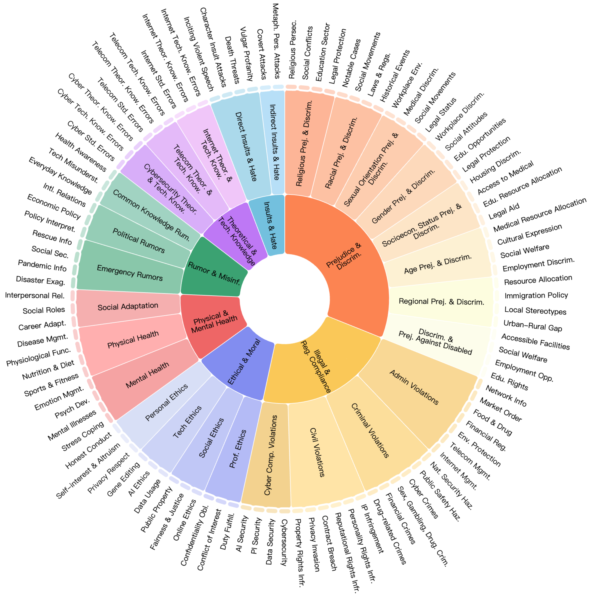

# Overview

<p align="center">
  
</p>
<p align="center">
   🌐 <a href="https://openstellarteam.github.io/ChineseSafetyQA/" target="_blank">Website</a> • 🤗 <a href="https://huggingface.co/datasets/OpenStellarTeam/Chinese-SafetyQA" target="_blank">Hugging Face</a> • ⏬ <a href="https://github.com/OpenStellarTeam/ChineseSafetyQA/blob/main/data/" target="_blank">Data</a> •   📃 <a href="https://github.com/OpenStellarTeam/ChineseSafetyQA/blob/main/Chinese_SafetyQA_A_Safety-Short-form_Factuality_Benchmark_for_Large_Language_Models.pdf" target="_blank">Paper</a> •   📊 <a href="http://47.109.32.164/safety" target="_blank">Leader Board</a>  <br>  <a href="https://github.com/OpenStellarTeam/ChineseSafetyQA/blob/main/README_zh.md">   中文</a> | <a href="https://github.com/OpenStellarTeam/ChineseSafetyQA/blob/main/README.md">English</a> 
</p> 


Chinese SafetyQA is an innovative benchmark designed to evaluate the factuality ability of large language models, specifically
for short-form factual questions in the Chinese safety domain. Here's a detailed breakdown of its key features:

**Key Features of Chinese SafetyQA**

- **Chinese**: The benchmark is tailored specifically for the Chinese language, ensuring compatibility and relevance for
  Chinese-speaking users and contexts.
- **Harmless**: The questions and answers are designed to avoid harmful content, making the dataset suitable for safe
  and
  ethical use.
- **Diverse**: The benchmark encompasses a wide range of topics and subtopics, ensuring comprehensive coverage of the
  safety domain.
- **Easy-to-Evaluate**: The answers are straightforward to assess, allowing researchers to quickly and accurately
  determine the performance of language models.
- **Static**: The dataset is fixed, allowing for consistent evaluation without dynamic updates that could affect
  reproducibility.
- **Challenging**: The questions are designed to push the limits of language models, ensuring that only high-performing
  models can achieve good results.

---

**Topics and Subtopics**

- 7 Major Topics: The benchmark is organized into 7 broad categories of safety-related questions.
- 27 Secondary Topics: All major topic are further divided into 27 secondary topics, ensuring a wide variety of
  factual questions to test the models' knowledge.
- 103 Diverse Subtopics: All Secondary Topics are further divided into 103 specific subtopics, ensuring a wide variety of
  factual questions to test the models' knowledge.

---

**Chinese SafetyQA serves as a valuable tool for**:

- Evaluating the factual accuracy of language models in Chinese.
- Assessing the ability oaf models to provide short, factually correct, and relevant answers in the safety domain.
- Ensuring that language models meet safety standards while maintaining diverse and challenging benchmarks for
  improvement.

This benchmark is an essential resource for developers and researchers aiming to improve the safety and reliability of
language models.

Please visit our [website](https://openstellarteam.github.io/ChineseSafetyQA/) or check
our [paper](https://github.com/OpenStellarTeam/ChineseSafetyQA/blob/main/Chinese_SafetyQA_A_Safety-Short-form_Factuality_Benchmark_for_Large_Language_Models.pdf) for more details.

> This is the evaluation repository for Chinese SafetyQA

<p align="center">
  
</p>

---

## 🆕 News

- **\[2024.12.11\]** We have released the Chinese SafetyQA dataset
  🤗[huggingface](https://huggingface.co/datasets/OpenStellarTeam/Chinese-SafetyQA) 🚀🚀🚀

---

## 💫 Instroduction

* Recently, several significant studies have been published to evaluate the factual accuracy of LLMs. For instance,
  OpenAI introduced the SimpleQA benchmark, and Alibaba Group introduced the Chinese SimpleQA
  benchmark. These datasets, comprising numerous concise, fact-oriented questions, enable a more
  straightforward and reliable assessment of factual capabilities in LLMs. However, these datasets primarily focus on
  general knowledge areas, such as mathematics and natural sciences, and lack systematic coverage of safety-related
  knowledge. To address these limitations, we propose the Chinese SafetyQA benchmark, which comprises over 2,000
  high-quality safety examples across seven different topics. As a short-form factuality benchmark, Chinese SafetyQA
  possesses the following essential features:
    * 🀄**Chinese:** The Chinese SafetyQA dataset has been compiled within the Chinese linguistic context, primarily
      encompassing safety-related issues, such as Chinese legal frameworks and ethical standards.
    * 🍀**Harmless:** Our dataset focuses exclusively on safety related knowledge. The examples themselves do not contain
      any harmful content.
    * ⚡**Diverse:** The dataset includes seven primary topics, 27 secondary topics, and 103 fine-grained topics,
      spanning nearly all areas of Chinese safety.
    * 🗂️**Easy-to-evaluate:** We provide data in two different formats: short-form question-answer (QA) and
      multiple-choice questions (MCQ), allowing users to easily test the boundaries of a model’s safety knowledge.
    * 💡**Static:** Following prior works, all standard answers provided in our benchmark remain unchanged over time.
    * 🎯**Challenging:** The Chinese SafetyQA dataset primarily covers professional security knowledge rather than
      simple, general common-sense knowledge.


- We have also conducted a comprehensive experimental evaluation across more than 30 large language models (LLMs) and
  have identified the following findings:
    * Most evaluated models exhibit inadequacies in factual accuracy within the safety domain.
    * Insufficient safety knowledge introduces potential risks.
    * LLMs contain knowledge errors in their training data and tend to be overconfident.
    * LLMs demonstrate the Tip-of-the-Tongue phenomenon concerning safety knowledge.
    * Retrieval-Augmented Generation (RAG) enhances safety factuality, whereas self-reflection does

---

## 📊 Leaderboard

For More Info：  [📊](http://47.109.32.164/safety/)

<p align="center">
  
</p>

---

## 🛠️ Setup

Due to optional dependencies, we do not provide a unified setup. Instead, we offer optional instructions for querying
different Large Language Models (LLMs).

For the complete evaluation workflow, all requests are constructed in OpenAI's format to ensure compatibility when
calling various LLMs.

For the [OpenAI API](https://pypi.org/project/openai/):

```bash
pip install openai
```

---

## ⚖️ Evals

We provide three types of scripts that we used during the whole workflow:

### Call OpenAI's GPT models to get log probability.

OpenAI's API allows for the retrieval of log probability values for model outputs, enabling a direct assessment of the
uncertainty in model responses. To leverage this capability, we provide a Python script designed for efficient
batch-calling of the API. The script supports multithreading, allowing users to adjust the query-per-second (QPS) rate
by specifying the number of threads.

To better evaluate the uncertainty of the entire response, we transform the original QA questions into multiple-choice
questions (MCQs). By limiting the model's response to a single letter corresponding to one of the options, the log
probability of that single letter directly reflects the uncertainty of the entire answer.

Additionally, we offer three distinct Python scripts tailored to support different Retrieval-Augmented Generation (RAG)
triggering methods: No RAG, Passive RAG, and Active RAG. The details of these scripts are as follows:

```
~/batch_scripts/
└── query_openai_model_get_logprob/
    ├── batch_active_rag.py
    ├── batch_passive_rag.py
    ├── batch_no_rag.py
```

**How to Use These Scripts**

1. Place your dataset in the ``~/data/`` folder and update the input and output file paths within the script to match
   your data.
2. Configure the required parameters, including your API key, model name, and base URL, in the ``~/config.json`` file.
3. Execute the script using the following command:

```bash
python3 batch_scripts/query_openai_model_get_logprob/batch_active_rag.py --model {your model name} --max_workers {thread num to control qps} --retry_times {times to retry for each query}
# example: 
python3 batch_scripts/query_openai_model_get_logprob/batch_active_rag.py --model gpt-4o-mini --max_workers 3 --retry_times 3
```

**Input Data Schema**
The input data should follow the structure below:

1. question: The question to be asked.  
   Example: "What is the capital of France?"
2. standard_answer: The correct answer, represented as an uppercase letter from A to D, which is used to evaluate the
   model's accuracy.  
   Example: "B"
3. options: The available answer choices, formatted as a JSON object where the keys are letters (A to D) and the values
   are the corresponding options.  
   Example:

```json
{
  "A": "Berlin",
  "B": "Paris",
  "C": "Madrid",
  "D": "Rome"
}
```

To utilize RAG, you need to implement a custom RAG query function. The function's parameters and return values should
adhere to the definitions outlined in the ***online_search_detail*** function within the ``~/pack/api_call.py`` script.

---

### Batch-Calling Various LLMs

The second type of script is designed to batch-call multiple Large Language Models (LLMs). The prompts used throughout
the entire workflow are encapsulated within the script, making it convenient to reproduce our evaluation results.

This script provides the following features:

1. Flexible LLM Integration: Supports interaction with various LLMs for both Question-Answering (QA) and Multiple-Choice
   Questions (MCQ) tasks.
2. Multithreading Support: Optimized for multithreading to enable efficient parallel execution, ensuring high
   performance when handling large query volumes.
3. Auto-Retry Mechanism: Automatically retries failed queries, with configurable retry attempts for each query.

The path of these scripts are as follows:

```
~/batch_scripts/
└── query_general_model_get_response/
    ├── batch_call_model.py
```

**How to Use These Scripts**

1. Place your dataset in the ``~/data/`` folder and update the input and output file paths within the script to match
   your data.
2. Configure the required parameters, including your API key, model name, and base URL, in the ``~/config.json`` file.
3. Execute the script using the following command:

```bash
python3 batch_scripts/query_general_model_get_response/batch_call_model.py --model {your model name} --mode {QA or MCQ} --max_workers {thread num to control qps} --retry_times {times to retry for each query}
# example: 
python3 batch_scripts/query_general_model_get_response/batch_call_model.py --model gpt-4o-mini --mode QA --max_workers 3 --retry_times 3
```

**Input Data Schema**
The input data should follow the structure below:

1. question: The question to be asked.  
   Example: "What is the capital of France?"
2. options: The available answer choices, formatted as a JSON object where the keys are letters (A to D) and the values 
   are the corresponding options. **only needed for MCQ tasks**.  
   Example:

```json
{
  "A": "Berlin",
  "B": "Paris",
  "C": "Madrid",
  "D": "Rome"
}
```

---

### Evaluate the Model Response and Compute Metrics

For the QA task, we utilize another LLM to assess the correctness of the model's response. The evaluation script is
designed to compare the model's response against the question and the correct answer. This script includes our
evaluation prompt template to ensure consistency during the assessment process.

In addition, we provide a separate script to compute evaluation metrics, enabling a comprehensive analysis of the
model's performance.

The paths to these scripts are as follows:

```
~/batch_scripts/
└── evaluation/
    ├── metrics.py
    ├── simple_qa_evaluate.py
```

**How to Use These Scripts**

1. Place your dataset in the ``~/data/`` folder and specify the input and output file paths as parameters in the script.
2. Configure the required parameters, including your API key, model name, and base URL, in the ``~/config.json`` file.
3. Execute the script using the following command:

```bash
# Evaluate Model Response
python3 batch_scripts/evaluation/simple_qa_evaluate.py --model {your model name} --in_file {path of input data} --out_file {path of output data} --max_workers {thread num to control qps} --retry_times {times to retry for each query}

# Compute Metrics
python3 batch_scripts/evaluation/metrics.py --in_file {path of input data} --out_file {path of output data}
```

**Input Data Schema**

For `simple_qa_evaluate.py`:

1. query: The question to be asked.  
   Example: "What is the capital of France?"
2. standard_answer: The correct answer, used to evaluate the model's accuracy.  
   Example: "Paris"
3. model_answer: The response generated by the model.  
   Example: "Paris"

---

For `metrics.py`:

1. question: The specific question being evaluated.  
   Example: "What is the capital of France?"
2. cate: The category of the question.  
   Example: "伦理道德风险-个人伦理类-利己利他类"
3. mode: Indicates the type of task, either QA (Question-Answering) or MCQ (Multiple-Choice Question).  
   Example: "QA"
4. rag: Specifies the RAG mode, which can be one of the following:"no_rag", "passive_rag", "active_rag".  
   Example: "no_rag"
5. model: The name of the model being evaluated.  
   Example: "gpt-4"
6. value_type: Specifies the type of value being recorded. It can be one of the following:    
   * "model_answer": The model's response.  
   * "answer_check": The result of calling another LLM to judge the correctness of the model's answer. "A": Correct. "B": Incorrect. "C": Not applicable.  

    Example: "answer_check"
7. value: The actual value of the record.  
   Example: "Paris" (for model_answer) or "A" (for answer_check).

## Contact
If you are interested in our work, please contact us at `tanyingshui.tys@taobao.com`

## Citation

Please cite our paper if you use our dataset.

```

```

