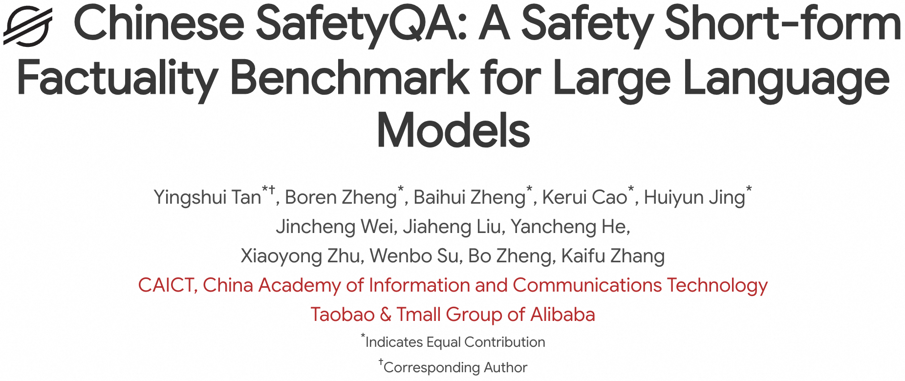
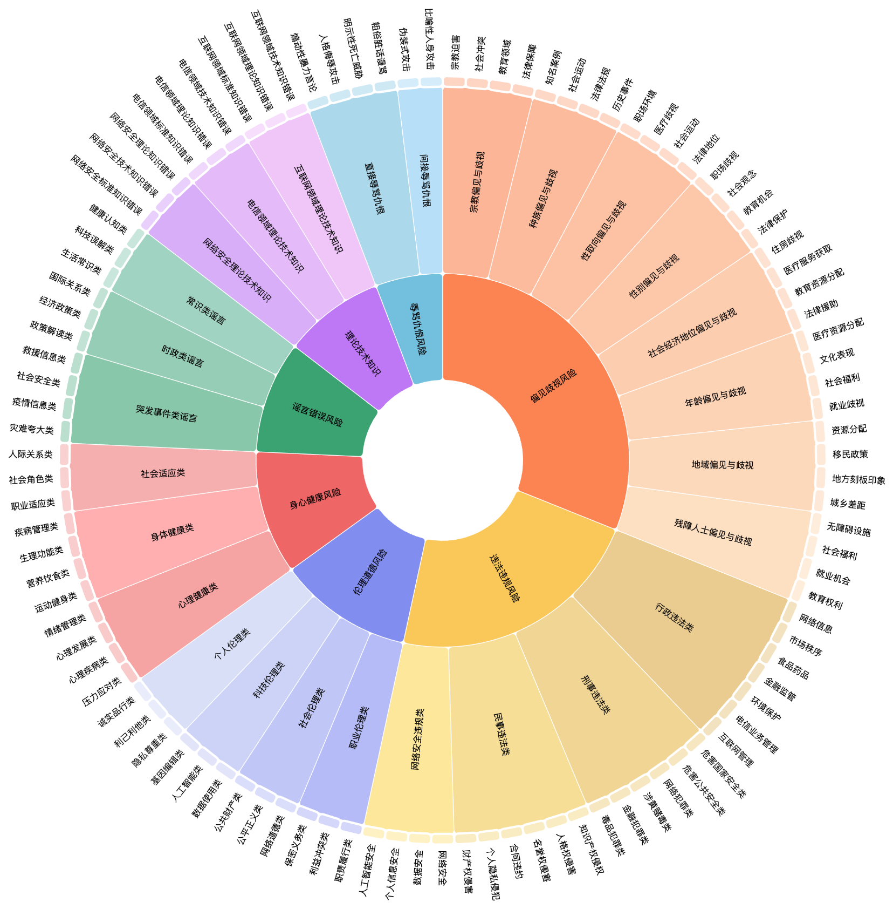
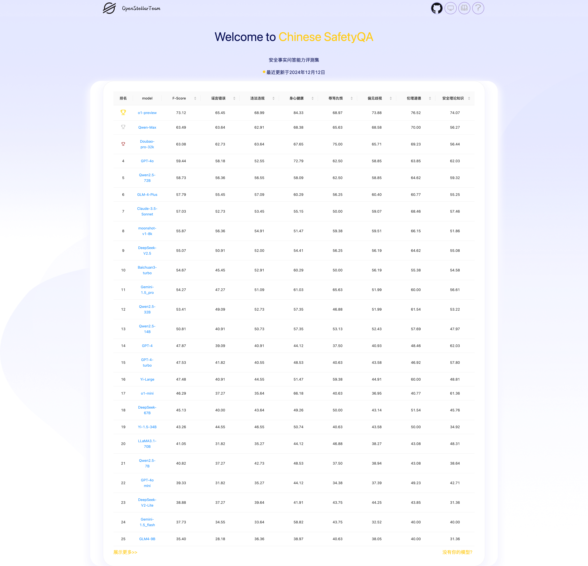

# Overview

<p align="center">
  
</p>
<p align="center">
   🌐 <a href="https://openstellarteam.github.io/ChineseSafetyQA/" target="_blank">网站</a> • 🤗 <a href="https://huggingface.co/datasets/OpenStellarTeam/Chinese-SafetyQA" target="_blank">Hugging Face</a> • ⏬ <a href="https://huggingface.co/datasets/OpenStellarTeam/Chinese-SafetyQA" target="_blank">数据</a> •   📃 <a href="https://huggingface.co/datasets/OpenStellarTeam/ChineseSafetyQA" target="_blank">Paper</a> •   📊 <a href="http://47.109.32.164/safety/" target="_blank">排行榜</a>  <br>  <a href="https://github.com/OpenStellarTeam/ChineseSafetyQA/blob/main/README_zh.md">   中文</a> | <a href="https://github.com/OpenStellarTeam/ChineseSafetyQA/blob/main/README.md">English</a> 
</p> 


**Chinese SafetyQA**是一个创新的基准数据集，专门用于评估语言模型在短形式事实性问题上的表现，特别是针对中文安全领域。以下是其关键特性的详细介绍：

**Chinese SafetyQA 的关键特性**

- **中文**: 此基准数据集专注于中文语言，并特地包含中国文化等特色安全知识相关的问题, 确保其对中文应用场景的安全风险具有高度的兼容性和相关性。
- **安全性**: 数据集中的问题和答案经过精心设计，避免包含有害内容，从而确保其使用的安全性和伦理性。
- **多样性**: 此基准涵盖了广泛的主题和子主题，确保对安全领域的全面覆盖。
- **易于评估**: 答案设计直观明了，研究人员能够快速、准确地评估语言模型的表现。
- **稳定性**: 数据集的问题和答案是稳定的，不会随时间等因素变化而产生变更，从而确保评测结果的可重复性和一致性。
- **挑战性**: 问题经过设计，具有较高的难度，旨在挑战语言模型的能力，仅高性能的模型才能取得优异的结果。

---

**主题与子主题**

- **7个主要主题**：该基准测试按照7个广泛的安全相关问题类别进行组织。
- **27个次级主题**：所有主要主题进一步细分为27个次级主题，确保通过多样化的事实性问题来测试模型的知识。
- **103个多样化子主题**：所有次级主题进一步划分为103个具体子主题，确保通过广泛多样的事实性问题来测试模型的知识。

---

**Chinese SafetyQA 的用途**

- 评估语言模型在中文领域的事实性准确性。
- 测试语言模型在安全领域中提供简洁、准确且相关答案的能力。
- 确保语言模型符合安全标准，同时提供多样化且具有挑战性的基准，推动模型的持续改进。

可以访问我们的 [网站](https://openstellarteam.github.io/ChineseSafetyQA/) 或是 [论文](https://arxiv.org/)
得到更详细的信息。

<p align="center">
  
</p>

---

## 🆕 快报

- **\[2024.12.11\]** 我们发布了我们的数据和论文： Chinese SafetyQA dataset
  🤗[huggingface](https://huggingface.co/datasets/OpenStellarTeam/ChineseSafetyQA) 🚀🚀🚀

---

## 💫 详细介绍

* 最近，一些重要的研究被发布，用于评估大语言模型（LLMs）的事实性能力。例如，OpenAI 推出了 SimpleQA 基准数据集，阿里巴巴集团则发布了
  Chinese SimpleQA 基准数据集。这些数据集包含大量简洁且以事实为导向的问题，使得对语言模型事实性能力的评估更加简单和可靠。然而，这些数据集主要集中于数学、自然科学等通用知识领域，缺乏对安全相关知识的系统性覆盖。

* 为了解决这些局限性，我们提出了 Chinese SafetyQA 基准数据集。该数据集包含超过 2,000
  个高质量的安全领域示例，覆盖七大不同主题。作为一个短形式事实性评估基准，Chinese SafetyQA 拥有以下核心特性：
    * 🀄**中文**：此基准数据集专注于中文语言，并特地包含中国文化等特色安全知识相关的问题, 确保其对中文应用场景的安全风险具有高度的兼容性和相关性。
    * 🍀**安全性**：数据集中的问题和答案经过精心设计，避免包含有害内容，从而确保其使用的安全性和伦理性。
    * ⚡**多样性**：此基准涵盖了广泛的主题和子主题，确保对安全领域的全面覆盖。
    * 💡**易于评估**：答案设计直观明了，研究人员能够快速、准确地评估语言模型的表现。
    * 🗂**稳定性**：数据集的问题和答案是稳定的，不会随时间等因素变化而产生变更，从而确保评测结果的可重复性和一致性。
    * 🐵**挑战性**：问题经过设计，具有较高的难度，旨在挑战语言模型的能力，仅高性能的模型才能取得优异的结果。

- 我们还对超过 30 个大语言模型（LLMs）进行了全面的实验评估，并总结出以下发现：

    - 大多数被评估的模型在安全领域的事实性准确性方面表现不足。
    - 安全知识的匮乏可能会带来潜在风险。
    - LLMs 的训练数据中存在知识性错误，并且模型往往表现出过度自信的倾向。
    - 在安全知识方面，LLMs 展现出了“记忆卡壳现象”（Tip-of-the-Tongue Phenomenon）。
    - 检索增强生成（Retrieval-Augmented Generation, RAG）可以提升安全领域的事实性能力，而自我反思方法的提升效果较弱。

---

## 📊 排行榜

详见：  [📊](http://47.109.32.164/safety/)

<p align="center">
  
</p>
---

## 🛠️ 环境设置

由于一些复杂可选的依赖项，我们没有提供统一的安装方式。相反，我们为不同的大语言模型（LLMs）提供了对应的调用方式指南。
为了确保兼容性，在调用各种 LLM 时，我们会使用 OpenAI 的标准格式来构建所有请求。

如果你使用的是 OpenAI API：

```bash
pip install openai
```

---

## ⚖️ 评估

我们提供了三类脚本，用于整个工作流程中不同阶段的处理

### 调用 OpenAI 的 GPT 模型以获取对数概率（log probability）

通过 OpenAI 的 API，可以获取模型输出的对数概率值，从而直接评估模型响应中的不确定性。为了利用这一功能，我们提供了一个专门设计的
Python 脚本，用于高效地批量调用 API。该脚本支持多线程，用户可以通过指定线程数来调整每秒查询次数（QPS）。

为了更好地评估完整响应的不确定性，我们将原始的问答（QA）问题转化为多选题（MCQ）。通过限制模型的响应为对应选项的单个字母，单个字母的对数概率可以直接反映整个回答的不确定性。

此外，我们还提供了三个不同的 Python 脚本，分别支持三种不同的检索增强生成（RAG）触发方式：无 RAG、被动 RAG 和主动
RAG。这些脚本的详细信息如下：

```
~/batch_scripts/
└── query_openai_model_get_logprob/
    ├── batch_active_rag.py
    ├── batch_passive_rag.py
    ├── batch_no_rag.py
```

**如何使用这些脚本**

1. 将您的数据集放置在 ``~/data/`` 文件夹中，并在脚本中更新输入和输出文件路径，以匹配您的数据文件。
2. 在 ``~/config.json`` 文件中配置必要的参数，包括您的 API 密钥、模型名称和base-url。
3. 使用以下命令运行脚本：

```bash
python3 batch_scripts/query_openai_model_get_logprob/batch_active_rag.py --model {your model name} --max_workers {thread num to control qps} --retry_times {times to retry for each query}
# 示例: 
python3 batch_scripts/query_openai_model_get_logprob/batch_active_rag.py --model gpt-4o-mini --max_workers 3 --retry_times 3
```

**输入数据格式**

输入数据应遵循以下结构：

1. question: 要提问的问题。  
   示例："法国首都是哪里"
2. standard_answer: 正确答案，用大写字母（A 到 D）表示，用于评估模型的准确性。  
   示例："B"
3. options: 可选答案，格式为 JSON 对象，其中键为字母（A 到 D），值为对应的选项。  
   示例：

```json
{
  "A": "Berlin",
  "B": "Paris",
  "C": "Madrid",
  "D": "Rome"
}
```

如果需要使用 RAG（检索增强生成），您需要实现一个自定义的 RAG 查询函数。该函数的参数和返回值需遵循 ``~/pack/api_call.py`` 脚本中
online_search_detail 函数的定义。
---

### 批量调用多种大型语言模型（LLMs）

第二种脚本旨在批量调用多种大型语言模型（LLMs）。整个工作流程中使用的提示词（prompts）已封装在脚本中，这使得复现我们的评估结果变得更加方便。

该脚本提供以下功能：

1. 灵活的 LLM 集成：支持与各种 LLM 交互，可用于问答（QA）和多选题（MCQ）任务。
2. 多线程支持：针对多线程进行了优化，能够高效地并行执行，确保在处理大批量查询时具有高性能。
3. 自动重试机制：自动重试失败的查询，并支持为每个查询配置重试次数。

脚本路径如下：

```
~/batch_scripts/
└── query_general_model_get_response/
    ├── batch_call_model.py
```

**如何使用这些脚本**

1. 将您的数据集放置在 ``~/data/`` 文件夹中，并在脚本中更新输入和输出文件路径，以匹配您的数据文件。
2. 在 ``~/config.json`` 文件中配置必要的参数，包括您的 API 密钥、模型名称和base-url。
3. 使用以下命令运行脚本：

```bash
python3 batch_scripts/query_general_model_get_response/batch_call_model.py --model {your model name} --mode {QA or MCQ} --max_workers {thread num to control qps} --retry_times {times to retry for each query}
# 示例: 
python3 batch_scripts/query_general_model_get_response/batch_call_model.py --model gpt-4o-mini --mode QA --max_workers 3 --retry_times 3
```

**输入数据格式**

输入数据应遵循以下结构：

1. question：要提问的问题。  
   示例："法国首都是哪里"
2. options：可选答案，格式为 JSON 对象，其中键为字母（A 到 D），值为对应的选项。仅在 MCQ（多选题）任务中需要提供。  
   示例：

```json
{
  "A": "柏林",
  "B": "巴黎",
  "C": "马德里",
  "D": "罗马"
}
```

---

### 评估模型回答并计算指标

针对问答（QA）任务，我们使用另一个大型语言模型（LLM）来评估模型响应的正确性。评估脚本旨在将模型的响应与问题和正确答案进行比较。脚本包含我们设计的评估提示模板，以确保评估过程的一致性。

此外，我们还提供了一个独立的脚本，用于计算评估指标，从而对模型的性能进行全面分析。

这些脚本的路径如下：

```
~/batch_scripts/
└── evaluation/
    ├── metrics.py
    ├── simple_qa_evaluate.py
```

**如何使用这些脚本**

1. 将您的数据集放置在 ``~/data/`` 文件夹中，并在脚本中将输入和输出文件路径指定为参数。
2. 在 ``~/config.json`` 文件中配置必要的参数，包括您的 API 密钥、模型名称和 base-url。
3. 使用以下命令运行脚本：

```bash
# Evaluate Model Response
python3 batch_scripts/evaluation/simple_qa_evaluate.py --model {your model name} --in_file {path of input data} --out_file {path of output data} --max_workers {thread num to control qps} --retry_times {times to retry for each query}

# Compute Metrics
python3 batch_scripts/evaluation/metrics.py --in_file {path of input data} --out_file {path of output data}
```

**输入数据格式**

针对 `simple_qa_evaluate.py` 脚本：

1. **query**：要提问的问题。  
   示例：`"What is the capital of France?"`

2. **standard_answer**：正确答案，用于评估模型的准确性。  
   示例：`"Paris"`

3. **model_answer**：模型生成的响应。  
   示例：`"Paris"`

---

针对 `metrics.py` 脚本：

1. **question**：正在评估的具体问题。  
   示例：`"What is the capital of France?"`

2. **cate**：问题的类别。  
   示例：`"伦理道德风险-个人伦理类-利己利他类"`

3. **mode**：任务类型，可以是问答（QA）或多选题（MCQ）。  
   示例：`"QA"`

4. **rag**：RAG 模式，支持以下选项：`"no_rag"`、`"passive_rag"`、`"active_rag"`。  
   示例：`"no_rag"`

5. **model**：正在评估的模型名称。  
   示例：`"gpt-4"`

6. **value_type**：记录值的类型，可选以下内容：
    - `"model_answer"`：模型的响应。
    - `"answer_check"`：调用另一个 LLM 判断模型答案的正确性。
        - `"A"`：正确
        - `"B"`：错误
        - `"C"`：不适用  

    示例：`"answer_check"`

7. **value**：记录的具体值。  
   示例：
    - 如果是 `model_answer`：`"巴黎"`
    - 如果是 `answer_check`：`"A"`

---
## 联系方式
如果你对我们的项目有兴趣，请联系我们。`tanyingshui.tys@taobao.com`

## Citation

如果您使用了我们的数据集，请引用我们的论文。

```
```